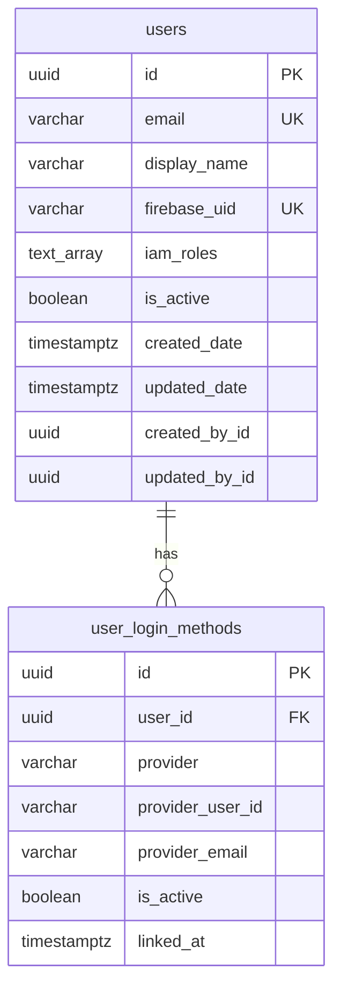
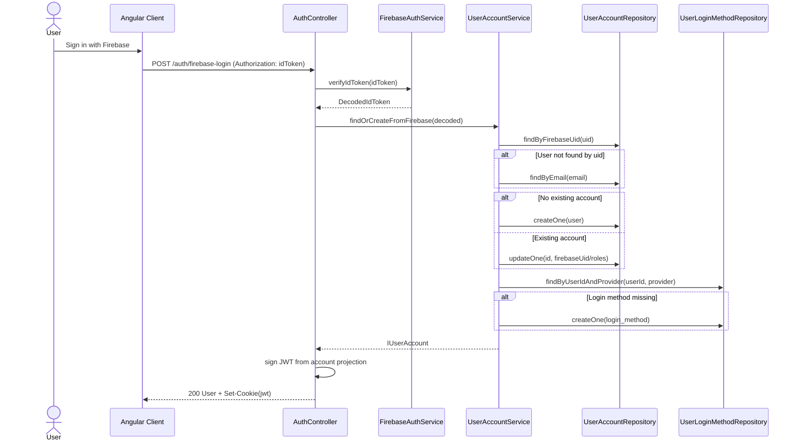

# Auth Package Spec

## Scope

The auth capability is split into three packages:

- `@meadsoft/auth-contracts`: shared auth types, schemas, and constants used by both backend and frontend code.
- `@meadsoft/auth-server-nestjs`: NestJS auth module, controller, guards, strategy, and persistence/infrastructure logic.
- `@meadsoft/auth-client-angular`: Angular client used to call auth endpoints.

## Package Responsibilities

### Contracts

- Defines canonical auth data contracts (`User`, `IUserAccount`, `IUserLoginMethod`).
- Owns runtime validation schemas (`UserSchema`, `UserAccountSchema`, `UserLoginMethodSchema`).
- Exposes shared constants and role definitions.

### Server

- Verifies Firebase ID tokens.
- Resolves or creates internal user account records.
- Persists account and login-method records.
- Issues and validates server JWT cookies.
- Exposes auth API endpoints (`/auth/firebase-login`, `/auth/logout`, `/auth/me`).

### Client

- Provides typed Angular client methods for auth endpoints.
- Sends auth requests with credentials enabled for cookie-based sessions.

## Data Model (ERD)

## Account Creation and Login Flow

## Invariants

- A single `users` row represents one logical account.
- `firebase_uid` is unique when present.
- A user can have multiple login methods, but only one per provider identity.
- Server JWT payload must validate against `UserSchema`.
